# Analyzing the increase function of Prometheus

This article attempts to explain how the `increase` function of Prometheus works, and how to get an intuition about it when analyzing a plot. This is the first chapter of a 2-part series about using `increase` for anomaly detection.

When I first used `increase`, I thought that it was just a derivative for discrete functions. Which is true, but the hard part came when I had to interpret some Grafan plots that were using `increase`. My intuition about derivatives of continuous functions didn't really help me have a better understanding. This article will help you to get that missing intuition that you need when doing visual analysis on plots based on `increase`.

[The documentation](https://prometheus.io/docs/prometheus/latest/querying/functions/#increase) for the function states:
> increase(v range-vector) calculates the increase in the time series in the range vector. Breaks in monotonicity (such as counter resets due to target restarts) are automatically adjusted for. The increase is extrapolated to cover the full time range as specified in the range vector selector, so that it is possible to get a non-integer result even if a counter increases only by integer increments.

> increase should only be used with counters (for both floats and histograms). It is syntactic sugar for rate(v) multiplied by the number of seconds under the specified time range window, and should be used primarily for human readability. Use rate in recording rules so that increases are tracked consistently on a per-second basis.

When I first read that, I found it lacking in detail. I needed a mathematical definition of `increase`. So I built one myself, starting from the basics.

**Disclaimer:** I will not explain everything about the function, since some details are not that relevant. If you need an authoritative reference, [you can check the golang source code](https://github.com/prometheus/prometheus/blob/9c23509790a38e4f5ec38b0c60c91d2a4fb45bd0/promql/functions.go#L469-L472), which I found pretty easy to read (you need to know some high-school-level math, though). Some of my explanations are based on that source code.

## Range vector

One of the types commonly used for time series is a range vector:
```
v[range] = (t1, v1), (t2, v2), (t3, v3), ..., (tn, vn)
```
Which is a vector of tuples, where each tuple has a timestamp and a value. The timestamps are increasing. The range acts like a selector. It can be represented by an interval defined by `rangeStart` and `rangeEnd`, and selects all the values in the vector whose timestamps are in that interval: `rangeStart <= ti <= rangeEnd`. Prometheus encourages you to use a single value for ranges, and `rangeEnd` is assumed to be the current time. For example `v[5h]` is selecting an interval defined by `rangeEnd = now()` and `rangeStart = rangeEnd - 5h`.

## Instant vectors

Sometimes you might confuse instant vectors with range vectors. For example, the following is a range vector `counter[5h]`. But `increase(counter[5h])` is an instant vector, which means that it's one value.

However, when you enter these expressions in Grafana, if you give it a range vector, it will tell you:
> invalid expression type "range vector" for range query, must be Scalar or instant Vector

So, in order to plot something, you need to provide an instant vector to Grafana. But the result will actually be a set of points plotted within a range configured from the Grafana dashboard. That's because Grafana actually queries Prometheus for a range vector.

Wait, so is it that really an instant vector or not? The answer is: the expression you give to Grafana is an instant vector, but before sending the query to Prometheus, it actually selects a range for it (depending on how you configure the dashboard). So, if the dashboard has a plot for the last 3 hours, then the expression `increase(counter[5h])` turns into the query `increase(counter[5h])[3h]`. If you are confused why there are two ranges, you can think of it like a for loop: you query `increase(counter[(rangeEnd-5h, rangeEnd)])` for each step point over the interval of 3 hours by varying the value of `rangeEnd` from `now() - 3h` until `now()`.

It's not relevant for this article the exact query Grafana sends. I just want it to be clear that `increase(v[range])` returns exactly one value. If you want to plot it, you'll need to evaluate it multiple times by shifting the right side of the range across the x-axis of the time plot.

## Monotonicity

Let's first clear one of the easier issues when it comes to time series: **counter resets**.

> Breaks in monotonicity (such as counter resets due to target restarts) are automatically adjusted for

How is the adjustment done, exactly?

It means that at some point, you would have $v_{i} > v_{i+1}$. If you just select a range vector that contains this, the corresponding values will be plotted - nothing unexpected. However, when you need to apply some functions to these range vectors, Prometheus will make the following assumption: if a break in monotonicity happens, it means that the counter was reset to 0. In its calculations, it will add an offset every time this happens, to turn the series into a monotonic one.

This means that the new value will be $v_{i+1}' = v_{i} + v_{i+1}$. The offset is $v_{i}$, and it will be added to all the values that follow $v_{i}$. For example, if a drop to 0 happens (i.e. $v_{i+1}$ becomes 0), that sample will actually take the value $v_{i+1}' = v_{i}$, as if no change would've happened.

This only makes sense when our metric is actually a counter, like the documentation of `increase` states:
> increase should only be used with counters (for both floats and histograms)

Here's a visual example. The following is a counter with resets:
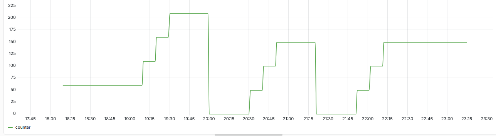

And here it is how Prometheus will interpret it when fed to the `increase` function:
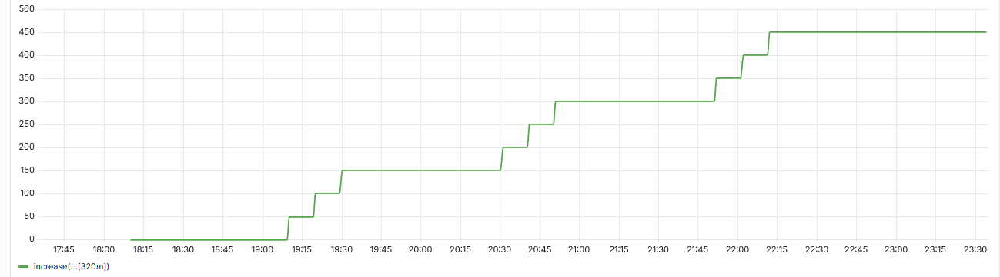

Here's a place in the implementation of the functions [where counter resets are handled](https://github.com/prometheus/prometheus/blob/9c23509790a38e4f5ec38b0c60c91d2a4fb45bd0/promql/functions.go#L243-L248):
```go
    for i, currPoint := range samples.Floats[1:] {
        prevPoint := samples.Floats[i]
        if currPoint.F < prevPoint.F || (i+1 < len(startTimestamps) && isStartTimestampReset(startTimestamps[i], prevPoint.T, startTimestamps[i+1], currPoint.T)) {
            resultFloat += prevPoint.F
        }
    }
```


## Extrapolation

Now, I will explain the following part:
> The increase is extrapolated to cover the full time range as specified in the range vector selector

Assuming `range := (rangeStart, rangeEnd)`, then the first selected sample in `v[range]` will be `(t1, v1)`, and `t1 >= rangeStart`. The range doesn't need to match the sampled timestamps exactly, so it is possible to have `t1 > rangeStart`.

As a consequence, instead of looking at `(t1, v1)`, Prometheus generates an extrapolated point `(t1', v1')`, which is extrapolated by assuming that the counter is linear. The points used for extrapolation are `(t1, v1)` and `(tn, vn)`. A similar thing happens for the right side of the interval - instead of using `(tn, vn)`, an extrapolated point `(tn', vn')` is used.

Usually, `t1' = rangeStart` and `tn' = rangeEnd`, but if these timestamps are too far from the actual ones, then Prometheus does some clipping. However, it is guaranteed that `t1' <= t1` and `tn' >= tn`.

Then `increase` function computes the difference `vn' - v1'` instead of `vn - v1`.

**Disclaimer:** The actual implementation of Prometheus handles some additional cases, and it doesn't explicitly generate `v1'` and `vn'`. It knows from the start that we want the difference between the last and the first sample, so it incorporates the extrapolation formula directly in the final result.

## The relation with rate

> It is syntactic sugar for rate(v) multiplied by the number of seconds under the specified time range window

[If we look at the documentation of `rate`](prometheus.io/docs/prometheus/latest/querying/functions/#rate), it is very similar to `increase`, so I will only paste here the interesting bit:
> rate(v range-vector) calculates the per-second average rate of increase of the time series in the range vector

*Average rate of increase* - if you're not familiar with TSDBs, this might sound ambiguous. Average relative to what? The number of samples? A time-weighted average? After reading [the source code for `extrapolatedRate`](https://github.com/prometheus/prometheus/blob/9c23509790a38e4f5ec38b0c60c91d2a4fb45bd0/promql/functions.go#L188), here's my own definition:

Given a range vector, `rate` computes the net increase divided by the total interval in seconds, which depends on the first and the last sample in the range:
```
rate(v[range]) = (vn - v1) / (tn - t1)
```

Going back to the definition of `increase`:
```
Simplified formula: increase(v[range]) = (vn - v1) / (tn - t1) * (rangeEnd - rangeStart)
```

But this is not the exact formula. It doesn't take into consideration the extrapolation. It also turns out that the *range window* is also clipped to the extrapolation.

In the next section, I'll wrap everything up.

## Formula

```
All the timestamps are measured in seconds.
Let range := (rangeStart, rangeEnd)
Let v[range] := [(v1, t1), (v2, t2), ..., (vn, tn)], where the timestamps are increasing and measured in seconds.
Assume the values are also increasing. Otherwise, adjust v[range] accordingly, as mentioned in the monotonicity section.
Let (v1', t1') and (vn', tn') be the extrapolated endpoints of v[range] (in practice, they are not too far away from (v1, t1) and (vn, tn)).
```

If we take extrapolation into consideration, the rate will be:
```
rate(v[range]) = (vn' - v1') / (tn' - t1')
```

What the documentation doesn't mention is that `(rangeStart, rangeEnd)` are replaced with `(t1', tn')`. If we apply the formula for `increase`, we get:
```
increase(v[range]) = rate(v[range]) * (tn' - t1') = vn' - v1'
```

Or an equivalent formula (based on the fact that the extrapolation is linear):
```
factor = (tn' - t1') / (tn - t1)
increase(v[range]) = (vn - v1) * factor
```

## Building the intuition

Even when you know the formula for `increase`, that's just one point. The real power of `increase` comes when it's sweeped across a range. I'll try to show you some examples and how to build an intuition about it. Hopefully, after reading this, you will be able to imagine how a counter might look, given the plot of its sweeped increase.

Here's a cheat sheet with some common patterns:
<div style="display:flex; justify-content:flex-start;">
    
</div>

One noticeable feature is that the slopes of the ascensions seem to be preserved in the increase plot. But not necessarily the length. That's because when a counter has a constant slope for a long enough time, the increase becomes constant. Remember that the increase function is trying to act like a derivative, so that shouldn't be a surprise.

The more complex behaviour can be seen when the counter is updating its slope within a short amount of time. It seems that there is a cummulative effect, but only when the changes in the slope are close enough.

Finally, there is also a pull-back after some time. Whenever the counter becomes constant, the `increase` plot thrives back to 0. There is some symmetry: the descent has the same shape as the descent. Why?

Now that you know the mathematical expression for `increase`, you might already have an idea to why the plots look like that. In the following sections, I'll try to explain these features.

## They're all just differences

This is how a sweeped `increase` works: you fix a time interval, D. You treat your counter plot as an X-Y coordinate plot. You start with two points on the plot whose x values are D seconds appart. You record the difference in the y values. You shift both points by an increment. Then you record the difference again and repeat.

You can imagine those two points at fixed distance moving continuously from one end of the plot to the other. I would've showed you a cool animation but I don't have one (contact me if you want to do it, I'd be happy to include it here).

If the sample rate is constant and small, then you'll have a nice property: the `factor` used in the formula will roughly be the same, because the `range` is shifted in both ends, keeping `rangeEnd - rangeStart` constant. Then, looking at the extrapolated timestamps: `t1'` , `tn'`, the difference `tn' - t1'` will be a constant factor of `rangeEnd - rangeStart`. However, this approximation becaomes weaker, the lower the sample rate is.

If the `factor` is roughly the same, then the ENTIRE plot of increase will be a factor of all the registered differences. This means that if the increase has value 1 at t=1h, and value 3 at t=2h, it means that at t=2h the counter increased three times as much as it increased at t=1h. The power of the `increase` function comes when you compare values from different times.

## Blips

Let's look at a simple pattern: an instant ascend followed by a plateau.

The actual counter (`increase` was not applied):
<div style="display:flex; justify-content:flex-start;">
    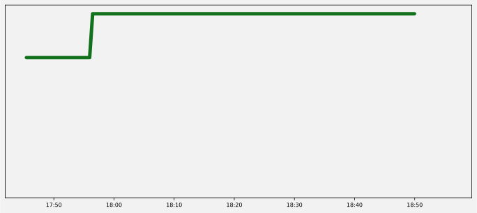
</div>

I'm claiming that the `increase` plot for this counter will look like a "blip" - something that increases rapidly and decreases rapidly after a short period of time.

I will try to convince you why is that, by looking at a continuous approximation of the counter above.

The following plot is arctan with a scaling factor (in red) and its derivative (in blue):
<div style="display:flex; justify-content:flex-start;">
    
</div>

The derivative looks like a blip. Actually, if I increase the scaling factor, the slope in arctan will become more abrupt, and the blip will become thinner and longer. Here you can play with this on Desmos: https://www.desmos.com/calculator/brieb8qiay.

But you might say: the actual `increase` plot looks more like a "blop" and less like a "blip". It waits some time until it decreases again:
<div style="display:flex; justify-content:flex-start;">
    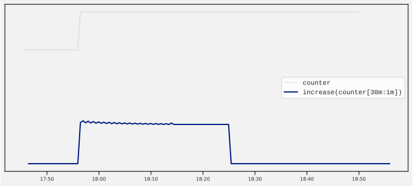
</div>

That's where the `increase` stops being a derivative, and starts being a difference. The length of the "blop" depends on the time interval in the range. For the plot above I used `increase(counter[30m])`. It's not a coincidence that for a length of 30m the line stays on "high".

If we use a 1m range instead of 30m, we get the following `increase` plot:
<div style="display:flex; justify-content:flex-start;">
    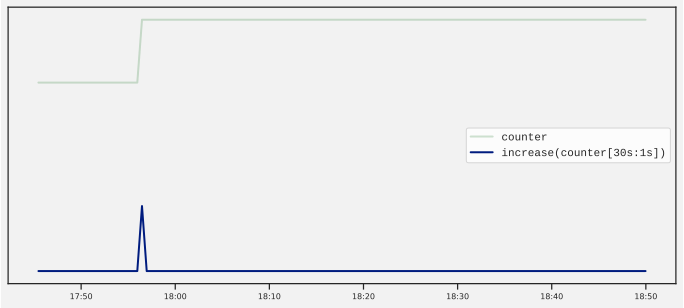
</div>

This is more like a blip, right? From now on, I will refer to all of them as blips, no matter how wide they are. You just have to remember that the blips would become visible if we make the query range very small.

There's also a mathematical way to compute differences in a similar way `increase` does. You do `f(x) - f(x - b)`, where `b` is the length of the range. Here you can play with it on Desmos: https://www.desmos.com/calculator/0qa7iqvucy.

## The hidden plateau

Cool, so instant changes create the following pattern: instant increase, followed by a plateau whose length depends on the range, then instant decrease.

Let's now look at a gradual change:
<div style="display:flex; justify-content:flex-start;">
    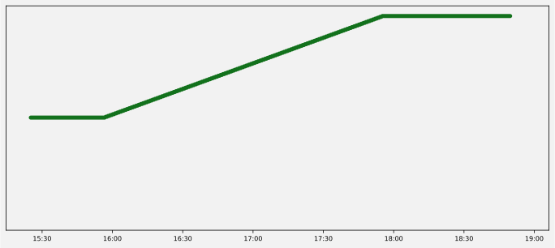
</div>

This is how the increase looks:
<div style="display:flex; justify-content:flex-start;">
    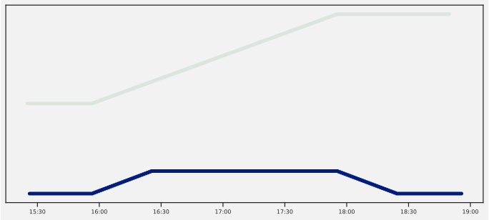
</div>

Well, I'd say it still looks like a blip: an increase followed by a plateau, followed by a decrease. But the increase is not instant. Actually the slope of the increase is the almost same as the slop of the ascension. It turns out that this is not a coincidence. The math can confirm this.

You can observer that the decrease in the increase (can you still follow?) stars happening when the counter becomes constant. This happens for the same reason the decrease happened in the previous case where we learned about blips. Similarly, it can be shown that the slope of the decrease is the same as the slope of the increase (but reversed).

But, there's something different from the previous blips? The plateau.

Here's the `increase` plot for the same counter, but with a 60m range, instead of 30m:
<div style="display:flex; justify-content:flex-start;">
    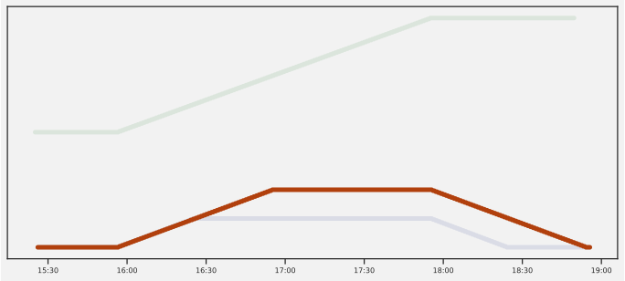
</div>

Do you see the problem? We've previously seen that the length of the plateau was matching the length of the range. But now, the plateau is shorter, despite the fact that we increased the query range?

Similarly, if we decrease the range to 10m, we get a longer plateau:
<div style="display:flex; justify-content:flex-start;">
    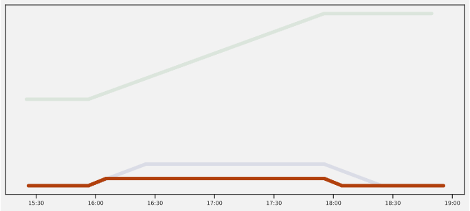
</div>

On the other hand, the more you increase the range, the longer gets the ascension. It looks like the `increase` plot is trying to look closer like the counter plot.

If you keep increasing the range, the plateau will get smaller and smaller. If you get past that, a new plateau appears. This is how it looks for a 140m range:
<div style="display:flex; justify-content:flex-start;">
    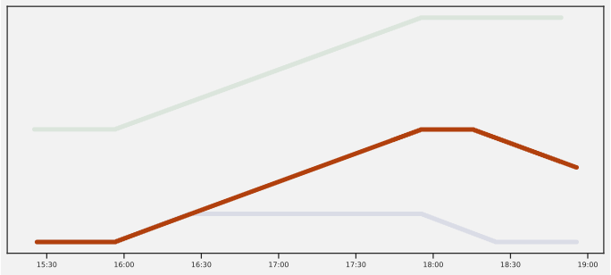
</div>

And now, it actually increases as we increase the range. But its length is not equal to the range. What actually was happening before was that the `increase` plot was trying to catch up the counter plot. But, because the endpoints of the range were too close, the plot was starting to forget its past too fast, and it was never getting to the real plateau. However, if the range is large enough, the ascension will be preserved in its entirety.

In fact, if the range is big enough, then `range length = length of ascension + length of plateau (in increase)`.

## Fast changes


<div style="display:flex; justify-content:flex-start;">
    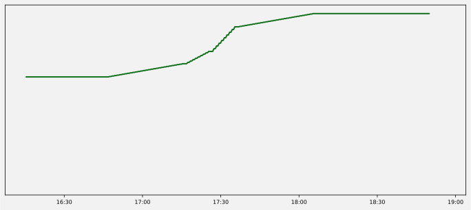
</div>

<div style="display:flex; justify-content:flex-start;">
    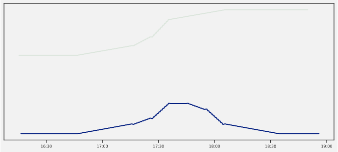
</div>

<div style="display:flex; justify-content:flex-start;">
    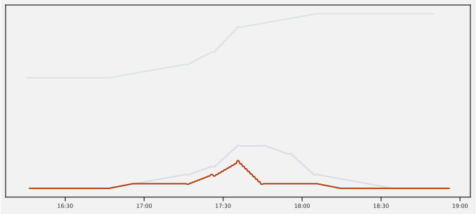
</div>

<div style="display:flex; justify-content:flex-start;">
    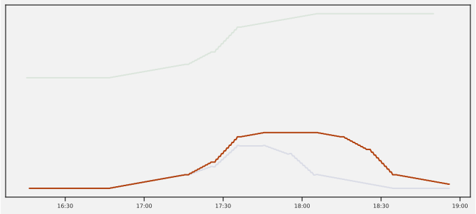
</div>

<div style="display:flex; justify-content:flex-start;">
    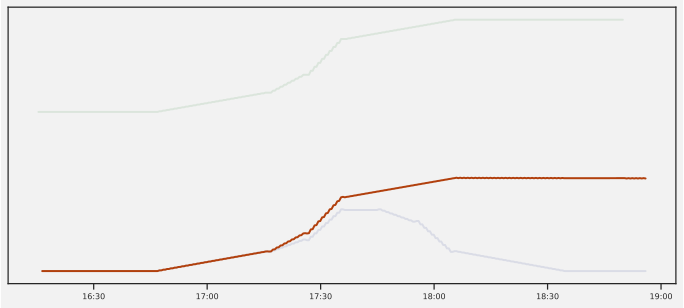
</div>
